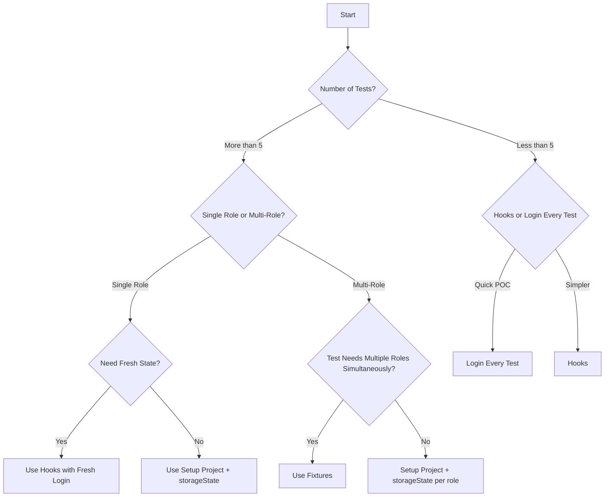

# A Standard Authentication Flow in Playwright: Stop Logging In Before Every Test

If you are new to Playwright, authentication can feel confusing at first.

You write one test, log in, check something, and everything looks fine. Then the test suite grows. Now every test starts with the same login steps:

```javascript
await page.goto('/login');
await page.getByRole('textbox', { name: 'Email address or Student ID' }).fill(email);
await page.getByRole('textbox', { name: 'Password' }).fill(password);
await page.getByRole('button', { name: 'Log In' }).click();
await page.waitForURL('/home');
```

It works, but it is slow. It also makes tests noisy. If the login page has a temporary issue, every test fails even though the actual feature under test may be fine.

The better direction is simple:

1. Keep login setup outside the main test body.
2. Make the actual test focus on the feature.
3. Choose the right strategy as the suite grows.

In this article, I will explain the common authentication strategies in Playwright, starting with hooks because they are the simplest improvement when you are not using saved storage yet. After that, we will move into `storageState`, `globalSetup`, setup projects, and fixtures.

---

## The Baseline Problem: Login Inside Every Test

A beginner Playwright test often looks like this:

```javascript
const { test, expect } = require('@playwright/test');

test('user can open dashboard', async ({ page }) => {
  await page.goto('https://example.com/login');
  await page.getByRole('textbox', { name: 'Email address or Student ID' }).fill('user@example.com');
  await page.getByRole('textbox', { name: 'Password' }).fill('password');
  await page.getByRole('button', { name: 'Log In' }).click();
  await page.waitForURL('https://example.com/home');

  await page.goto('https://example.com/dashboard');
  await expect(page).toHaveURL('https://example.com/dashboard');
});
```

For one test, this is okay.

For fifty tests, this becomes painful.

You are not really testing login in every test. You are testing dashboard, profile, settings, orders, permissions, or some other feature. Login is just a precondition.

So the clean question is:

> How can we remove repeated login code without making the test suite harder to understand?

The first real strategy many people try is hooks.

---

## Strategy 1: Using Hooks

One common approach is to use Playwright hooks, especially `beforeEach` or `beforeAll`.

Hooks are useful when you want to run setup code before tests. For authentication, that usually means logging in before each test or before a group of tests.

Example with `beforeEach`:

```javascript
const { test, expect } = require('@playwright/test');

test.beforeEach(async ({ page }) => {
  await page.goto('https://example.com/index.html');
  await page.getByRole('textbox', { name: 'Email address or Student ID' }).fill(process.env.USER_EMAIL);
  await page.getByRole('textbox', { name: 'Password' }).fill(process.env.USER_PASSWORD);
  await page.getByRole('button', { name: 'Log In' }).click();
  await page.waitForURL('https://example.com/home.html');
});

test('user can open dashboard', async ({ page }) => {
  await page.goto('https://example.com/dashboard');
  await expect(page).toHaveURL('https://example.com/dashboard');
});
```

This is already better than copying login steps inside every test body.

The test itself is cleaner:

```text
beforeEach handles login
test focuses on the feature
```

But the main problem is still there: login runs again and again.

If you have ten tests, login runs ten times. If you have one hundred tests, login runs one hundred times. That makes the suite slower and increases the chance of failures caused by the login page instead of the actual feature.

Hooks are good for small proof-of-concept test suites, tests that truly need a fresh login every time, or projects where you do not want to introduce saved browser state yet.

Once the suite starts growing, the repeated login cost becomes harder to ignore. At that point, the next natural step is to stop performing the UI login before every test:

> Log in once, save the browser state, and reuse it.

That brings us to `storageState`.

---

## What Is `storageState`?

When a user logs in, the browser usually stores session data in places like:

- cookies
- local storage

Playwright can save that authenticated state into a JSON file:

```javascript
await page.context().storageState({
  path: 'playwright/.auth/user.json'
});
```

Later, another test can reuse that file:

```javascript
test.use({
  storageState: 'playwright/.auth/user.json'
});
```

Now the test starts with an already authenticated browser context.

No login steps needed.

---

## Important Security Rule

The `storageState` file can contain sensitive cookies or tokens. Treat it like a password.

Keep it inside:

```text
playwright/.auth/
```

And add that folder to `.gitignore`:

```text
playwright/.auth/
```

This project already follows that rule, which is good. Never commit generated auth files like:

```text
playwright/.auth/user.json
playwright/.auth/admin.json
```

---

## Strategy 2: Using `globalSetup`

One common way to prepare authentication is `globalSetup`.

With this strategy, Playwright runs a separate setup function before the test runner starts. That function can open a browser, log in, save the authenticated state, and then close the browser.

The flow looks like this:

```text
global setup starts
    opens browser
    logs in as user
    saves playwright/.auth/user.json
test runner starts
    tests reuse saved auth state
```

A simple `globalSetup` file can look like this:

```javascript
const { chromium } = require('@playwright/test');

async function globalSetup() {
  const browser = await chromium.launch();
  const page = await browser.newPage();

  await page.goto('https://example.com/index.html');
  await page.getByRole('textbox', { name: 'Email address or Student ID' }).fill(process.env.USER_EMAIL);
  await page.getByRole('textbox', { name: 'Password' }).fill(process.env.USER_PASSWORD);
  await page.getByRole('button', { name: 'Log In' }).click();
  await page.waitForURL('https://example.com/home.html');

  await page.context().storageState({
    path: 'playwright/.auth/user.json'
  });

  await browser.close();
}

module.exports = globalSetup;
```

Then you connect it in the Playwright config:

way 1: Inside projects

```javascript
module.exports = {
  globalSetup: require.resolve('./auth.setup')
};
```

way 2: Inside "export default defineConfig"
```javascript
globalSetup: './auth.setup.js',
```

This works, and it is easy to understand.

But there is one important limitation: `globalSetup` runs outside the normal Playwright Test lifecycle. So the login flow is not treated like a normal test. You do not get the same clean reporting, tracing, retries, and project-level behavior that you get from a setup project.

That is why I see `globalSetup` as useful for general one-time preparation, but not my first choice for UI authentication.

For authentication, I usually prefer the next strategy.

---

## Strategy 3: Setup Project + `storageState`

The most standard Playwright authentication pattern is the setup project pattern.

Instead of running login manually before every test, we create a special setup test. That setup test logs in and saves the authenticated state.

Then the real test projects depend on that setup project.

The flow looks like this:

```text
auth.setup.js
    logs in
    saves playwright/.auth/user.json

chromium project
    waits for setup
    starts tests with user.json

firefox project
    waits for setup
    starts tests with user.json

webkit project
    waits for setup
    starts tests with user.json
```

This is better than a separate `globalSetup` file because the login step becomes part of Playwright Test itself. That means it can appear in reports, traces, retries, and debugging tools.

---

## Step 1: Create an Auth Setup Test

Create a setup file:

```text
tests/auth/user.setup.js
```

Example:

```javascript
const { test, expect } = require('@playwright/test');

test('authenticate as user', async ({ page }) => {
  await page.goto('https://example.com/index.html');

  await page
    .getByRole('textbox', { name: 'Email address or Student ID' })
    .fill(process.env.USER_EMAIL);

  await page
    .getByRole('textbox', { name: 'Password' })
    .fill(process.env.USER_PASSWORD);

  await page.getByRole('button', { name: 'Log In' }).click();

  await page.waitForURL('https://example.com/home.html');
  await expect(page.locator('#email')).toHaveText(process.env.USER_EMAIL);

  await page.context().storageState({
    path: 'playwright/.auth/user.json'
  });
});
```

The key line is:

```javascript
await page.context().storageState({
  path: 'playwright/.auth/user.json'
});
```

That writes the logged-in browser state to a file.

In real projects, prefer environment variables for usernames and passwords. Avoid hardcoding credentials in test files.

---

## Step 2: Connect Setup to Your Browser Projects

In `playwright.config.js`, add a setup project and make browser projects depend on it:

```javascript
import { defineConfig, devices } from '@playwright/test';

export default defineConfig({
  testDir: './tests',
  reporter: 'html',

  use: {
    trace: 'on-first-retry'
  },

  projects: [
    {
      name: 'setup',
      testDir: './tests/auth',
      testMatch: /user\.setup\.js/
    },

    {
      name: 'chromium',
      use: {
        ...devices['Desktop Chrome'],
        storageState: 'playwright/.auth/user.json'
      },
      dependencies: ['setup']
    },

    {
      name: 'firefox',
      use: {
        ...devices['Desktop Firefox'],
        storageState: 'playwright/.auth/user.json'
      },
      dependencies: ['setup']
    },

    {
      name: 'webkit',
      use: {
        ...devices['Desktop Safari'],
        storageState: 'playwright/.auth/user.json'
      },
      dependencies: ['setup']
    }
  ]
});
```

The important part is:

```javascript
dependencies: ['setup']
```

This tells Playwright:

> Run the setup project first. Only start the browser tests after authentication is ready.

---

## Step 3: Write Tests Without Login Code

Now your test can be clean:

```javascript
const { test, expect } = require('@playwright/test');

test('user can open dashboard', async ({ page }) => {
  await page.goto('https://example.com/slider.html');
  await expect(page).toHaveURL('https://example.com/slider.html');
});
```

Notice what is missing:

No email.

No password.

No login button.

The test starts already authenticated because the project loaded:

```text
playwright/.auth/user.json
```

That is the clean separation we want.

Login is setup. The test is only about the feature.

---

## Multiple Roles: Admin and Regular User

Many real test suites need more than one role.

For example:

- admin can manage users
- regular user can view profile
- manager can approve requests

In that case, save one storage file per role:

```text
playwright/.auth/admin.json
playwright/.auth/user.json
playwright/.auth/manager.json
```

The setup project can authenticate each role and save each file.

Example:

```javascript
const { test, expect } = require('@playwright/test');

async function login(page, email, password, authFile) {
  await page.goto('https://example.com/index.html');
  await page.getByRole('textbox', { name: 'Email address or Student ID' }).fill(email);
  await page.getByRole('textbox', { name: 'Password' }).fill(password);
  await page.getByRole('button', { name: 'Log In' }).click();
  await page.waitForURL('https://example.com/home.html');
  await expect(page.locator('#email')).toHaveText(email);

  await page.context().storageState({ path: authFile });
}

test('authenticate as admin', async ({ page }) => {
  await login(
    page,
    process.env.ADMIN_EMAIL,
    process.env.ADMIN_PASSWORD,
    'playwright/.auth/admin.json'
  );
});

test('authenticate as user', async ({ page }) => {
  await login(
    page,
    process.env.USER_EMAIL,
    process.env.USER_PASSWORD,
    'playwright/.auth/user.json'
  );
});
```

Then a test file can choose the state it needs:

```javascript
const { test, expect } = require('@playwright/test');

test.describe('Admin scenarios', () => {
  test.use({
    storageState: 'playwright/.auth/admin.json'
  });

  test('admin can see admin account', async ({ page }) => {
    await page.goto('https://example.com/home.html');
    await expect(page.locator('#email')).toHaveText(process.env.ADMIN_EMAIL);
  });
});

test.describe('Regular user scenarios', () => {
  test.use({
    storageState: 'playwright/.auth/user.json'
  });

  test('user can see user account', async ({ page }) => {
    await page.goto('https://example.com/home.html');
    await expect(page.locator('#email')).toHaveText(process.env.USER_EMAIL);
  });
});
```

This is a simple and readable way to handle multiple roles when each test only needs one role at a time.

---

## Strategy 4: Using Fixtures

Sometimes one test needs multiple logged-in users at the same time.

Example:

1. Admin creates or approves something.
2. Regular user logs in and verifies the result.

In that case, switching `test.use({ storageState })` is not enough, because one test needs two authenticated pages.

This is where fixtures are useful.

In this project, the fixture idea looks like this (fixtures.js) :

```javascript
const { test: base, expect } = require('@playwright/test');
const { loginAndGetContext } = require('../helpers/auth/login');

const test = base.extend({
  adminPage: async ({ browser }, use) => {
    const { page, context } = await loginAndGetContext(browser, 'test1212@gmail.com', 'test1212');

    try {
      await use(page);
    } finally {
      await context.close();
    }
  },

  userPage: async ({ browser }, use) => {
    const { page, context } = await loginAndGetContext(browser, 'user1212@gmail.com', 'test1212');

    try {
      await use(page);
    } finally {
      await context.close();
    }
  }
});

module.exports = { test, expect };

```

login.js will have minor global change but the functionality remains the same

```javascript
const LOGIN_URL = 'https://example.com/index.html';
const HOME_URL = 'https://example.com/home.html';

async function loginAndGetContext(browser, userName, password) {
    const context = await browser.newContext({
        storageState: { cookies: [], origins: [] },
    });
    const page = await context.newPage();

    await page.goto(LOGIN_URL);
    await page.getByRole('textbox', { name: 'Email address or Student ID' }).fill(userName);
    await page.getByRole('textbox', { name: 'Password' }).fill(password);
    await page.getByRole('button', { name: 'Log In' }).click();
    await page.waitForURL(HOME_URL);

    return { page, context };
}

module.exports = { loginAndGetContext };

```

Then the test becomes very expressive:

```javascript
const { test, expect } = require('../fixtures');

test('admin can open the drop down page', async ({ adminPage }) => {
    await adminPage.goto('https://example.com/home.html');
    await adminPage.getByRole('link', { name: 'Drop down (current)' }).click();
    await expect(adminPage).toHaveURL('https://example.com/drop-down.html');
});

```

This reads nicely:

```text
Give me an admin page.
Give me a user page.
Now test the flow.
```

Use fixtures when your test needs multiple roles or dynamic authentication behavior.

---

## A Practical Folder Structure

A clean structure can look like this:

```text
tests/
  auth/
    user.setup.js
    admin.setup.js
  helpers/
    auth.js
  fixtures.js
  single_login.spec.js
  multi_login.spec.js

playwright/
  .auth/
    user.json
    admin.json

playwright.config.js
```

Remember:

```text
playwright/.auth/
```

should be ignored by Git.

---

## Common Mistakes to Avoid

Do not save the storage state before login is fully complete.

Wait for the final URL or a reliable element that proves the user is logged in:

```javascript
await page.waitForURL('https://example.com/home.html');
await expect(page.locator('#email')).toHaveText(process.env.USER_EMAIL);
```

Do not commit `user.json`, `admin.json`, or any other auth state file.

Do not hardcode real credentials in examples that will be shared publicly.

Do not use one shared account for tests that change the same server-side data in parallel. If tests modify shared state, consider separate accounts per worker or per role.

Do not use fixtures for everything. Fixtures are powerful, but the setup project pattern is simpler for normal authenticated tests.

If you use Playwright UI mode and your saved authentication expires, run the setup test again before running the dependent tests.

---


## Detailed Strategy Comparison

Here is the bigger picture.

There is one baseline approach and four common authentication strategies in Playwright:

1. Baseline: login inside every test, the naive approach.
2. Strategy 1: hooks, using `beforeEach` or `beforeAll`.
3. Strategy 2: `globalSetup`, the legacy approach.
4. Strategy 3: setup project + `storageState`, the standard approach.
5. Strategy 4: fixtures, the advanced approach.

| Parameter | Login Inside Every Test | Hooks | `globalSetup` | Setup Project + `storageState` | Fixtures |
| --- | --- | --- | --- | --- | --- |
| Execution speed | Very slow | Slow | Fast | Very fast | Very fast |
| Setup overhead | High, runs N times | High, often runs N times | Low, runs once | Low, runs once per project | Low, usually once per worker |
| Test independence | Complete | Complete | Shared state | Complete | Complete |
| Parallel execution support | Yes | Limited | Limited | Yes | Yes |
| Multi-role support | Yes, but repetitive | Difficult | Difficult | Good per role or per test file | Excellent |
| Debugging and reporting | Full traces | Limited or noisy | Limited | Full traces | Full traces |
| Trace Viewer support | Yes | Partial | No | Yes | Yes |
| Retry support | Yes | Partial | No | Yes | Yes |
| CI/CD performance | Poor | Poor | Good | Excellent | Excellent |
| Code duplication | Massive | Some | Minimal | Minimal | None |
| Setup complexity | Very simple | Simple | Moderate | Moderate | Complex |
| Maintainability | Poor | Fair | Good | Excellent | Excellent |
| Session expiry handling | Auto retry through login | Manual | Manual | Re-run setup | Re-run setup |
| Fresh state per test | Always | Always | Never | Via new context | Via new context |
| Resource usage | High | High | Low | Medium | Medium |
| Learning curve | Easy | Easy | Moderate | Moderate | Steep |
| Scalability, 10 tests | Around 50s | Around 50s | Around 23s | Around 23s | Around 23s |
| Scalability, 100 tests | Around 500s | Around 500s | Around 203s | Around 203s | Around 203s |
| UI mode support | Yes | Yes | No | Yes | Yes |
| Login failure impact | Isolated | All tests fail | All tests fail | Setup fails, tests skip | Setup fails, tests skip |

These numbers are simple examples. Assume login takes around three seconds, and each actual test takes around two seconds.

```text
Setup Project:    23s for 10 tests, login 3s + tests 20s
Fixtures:         23s for 10 tests, similar to setup project
globalSetup:      23s for 10 tests, similar performance
Hooks:            50s for 10 tests, login runs 10 times
Login Every Test: 50s for 10 tests, login runs 10 times
```

## Maintainability Score

| Strategy | Code Duplication | Test Readability | Configuration Complexity | Total Score |
| --- | --- | --- | --- | --- |
| Login every test | 10/10, worst | 3/10 | 1/10 | 14/40 |
| Hooks | 6/10 | 5/10 | 3/10 | 18/40 |
| `globalSetup` | 3/10 | 7/10 | 5/10 | 25/40 |
| Setup project | 2/10 | 9/10 | 6/10 | 33/40 |
| Fixtures | 1/10 | 10/10 | 7/10 | 34/40 |

Fixtures score highest for maintainability when you need advanced flows, especially multi-role testing. Setup projects are close behind and are easier to start with.

## Resource Usage

Memory usage per worker:

- Login every test: around 50MB per test.
- `globalSetup`: around 100MB once.
- Setup project: around 50MB per worker.
- Fixtures: around 50MB per worker, plus extra for multi-role tests.
- Hooks: around 50MB per test because the login flow is recreated.

CPU usage:

- Login every test: high because login repeats.
- `globalSetup`: low because it runs once.
- Setup project: low because setup runs once.
- Fixtures: low because authenticated contexts can be reused carefully.
- Hooks: high because login repeats.

## Decision Matrix



## Quick Decision Table

| Scenario | Recommended Strategy | Reason |
| --- | --- | --- |
| Proof of concept, 1-5 tests | Hooks or login every test | Simplicity over performance |
| Standard test suite, 10-100 tests | Setup project + `storageState` | Best balance of speed and simplicity |
| Enterprise suite, 100+ tests | Setup project + `storageState` plus fixtures | Scalable and maintainable |
| Multi-role tests | Fixtures | Cleanest multi-role support |
| Tests needing fresh state per run | Hooks | Easy per-test fresh login |
| Different roles in the same test | Fixtures | Cleanest way to handle multiple contexts |
| CI/CD pipeline | Setup project + `storageState` | Fast execution |
| Local development | Setup project + `storageState` or fixtures | Quick feedback loop |
| Database setup or seeding | `globalSetup` | Better for non-authentication tasks |
| One-off admin tasks | `globalSetup` | Useful for quick one-time setup |
| Multiple browser testing | Setup project + `storageState` | Best parallel browser support |
| Dynamic credentials | Hooks | Easy to parameterize |

## The 80/20 Rule

For most teams, the choice is simpler than it looks.

Use setup project + `storageState` for around 80% of cases:

- fastest execution
- clean code
- good debugging
- easy maintenance

Use fixtures for around 15% of cases:

- multi-role tests
- complex workflows
- multiple authenticated contexts in one test

Use hooks, `globalSetup`, or login inside every test for the remaining 5%:

- quick prototypes
- special scenarios
- non-authentication setup

---

## Further Reading

Playwright authentication documentation: https://playwright.dev/docs/auth

## Demo Link
Playwright authentication documentation: https://playwright.dev/docs/auth